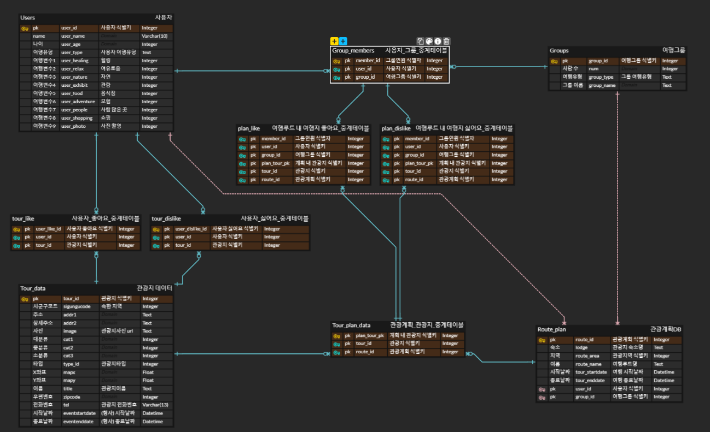

# 마음끗 마카_DB
## 프로젝트 개요
### 개발 기간
2024.06.01 ~
### Members
팀원|신희진|주소영
---|---|---
Git|[@Sinijini](https://github.com/Sinijinii)|[@address0](https://github.com/address0)
역할|추천 알고리즘 모델링(팀장)|DB 전처리
### Tech
- Django 4.2.13
### 실행 환경
```bash
# 더미데이터 저장 시, 데이터 관계 유지를 위해 저장 순서 지켜야 함
$ python manage.py loaddata users.json groups.json group_members.json
```
### DB 설명
